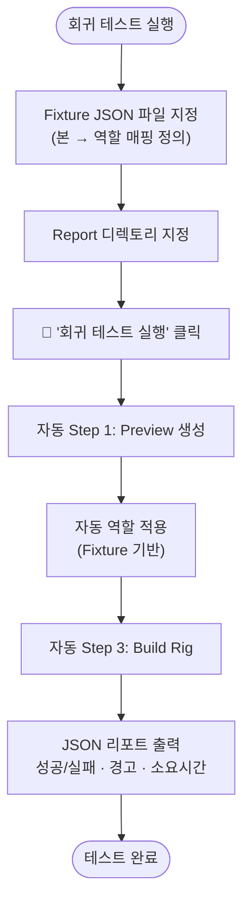

# BlenderRigConvert 워크플로우

## 메인 파이프라인

```mermaid
flowchart TD
    Start([Blender에서 소스 아마추어 열기]) --> Select[소스 아마추어 선택]
    Select --> Step1

    subgraph Step1 ["Step 1: 리그 분석 + Preview 생성"]
        S1_Click["🔘 '리그 분석 + Preview 생성' 클릭"]
        S1_Analyze["analyze_skeleton() 실행<br/>디폼 본 추출 · 체인 탐색 · 역할 추론"]
        S1_DEF["DEF 본 분리<br/>역할 기반 해부학적 계층 생성<br/>(소스 아마추어에 DEF-* 본 추가)"]
        S1_Preview["Preview Armature 생성<br/>DEF 계층 기반 · 역할별 색상 적용"]
        S1_Conf["신뢰도 표시 (0~100%)"]
        S1_Click --> S1_Analyze --> S1_DEF --> S1_Preview --> S1_Conf
    end

    S1_Conf --> S1_Check{분석 성공?}
    S1_Check -- "실패" --> Select
    S1_Check -- "성공<br/>is_analyzed = True" --> Step2

    subgraph Step2 ["Step 2: 역할 편집 (반복)"]
        S2_Tree["Source Hierarchy 트리에서<br/>본 클릭 → 선택"]
        S2_Role["역할 버튼 클릭<br/>body · legs · feet · head · unmapped"]
        S2_Foot{foot 역할?}
        S2_Guide["bank/heel 가이드 본<br/>자동 생성"]
        S2_Parent["(선택) 부모 본 변경"]
        S2_Done{모든 본<br/>역할 할당?}

        S2_Tree --> S2_Role --> S2_Foot
        S2_Foot -- "Yes" --> S2_Guide --> S2_Parent
        S2_Foot -- "No" --> S2_Parent
        S2_Parent --> S2_Done
        S2_Done -- "No" --> S2_Tree
    end

    S2_Done -- "Yes" --> Step3

    subgraph Step3 ["Step 3: Build Rig"]
        S3_Click["🔘 'ARP 리그 생성' 클릭<br/>(앞다리 3-Bones IK 슬라이더 조정 가능)"]
        S3_DEFSync["DEF 본 계층 동기화<br/>(역할 편집 반영)"]
        S3_Append["ARP dog 프리셋 Append<br/>face/skull 비활성화"]
        S3_Ref["ref 본 정렬<br/>역할 → ARP ref 체인 매핑<br/>체인 수 조정 (set_spine 등)"]
        S3_Match["match_to_rig 실행<br/>IK/FK 컨트롤 생성"]
        S3_CC["cc_ 커스텀 본 생성<br/>(unmapped 역할 · 얼굴 본)"]
        S3_Weight["웨이트 전송<br/>소스 → ARP deform 본"]
        S3_Driver["드라이버 리맵<br/>Shape Key 드라이버 복사"]
        S3_Done2["✅ ARP 리그 생성 완료"]

        S3_Click --> S3_DEFSync --> S3_Append --> S3_Ref --> S3_Match
        S3_Match --> S3_CC --> S3_Weight --> S3_Driver --> S3_Done2
    end

    S3_Done2 --> Finish([완료: ARP 리그 + 메시 준비됨])
```

## 회귀 테스트 경로

## 역할 카테고리

| 카테고리 | 역할 |
|---------|------|
| Body | `root`, `spine`, `neck`, `head`, `tail` |
| Legs | `back_leg_l/r`, `front_leg_l/r` |
| Feet | `back_foot_l/r`, `front_foot_l/r` |
| Head | `ear_l/r` |
| 기타 | `unmapped` → cc_ 커스텀 본 처리 |
